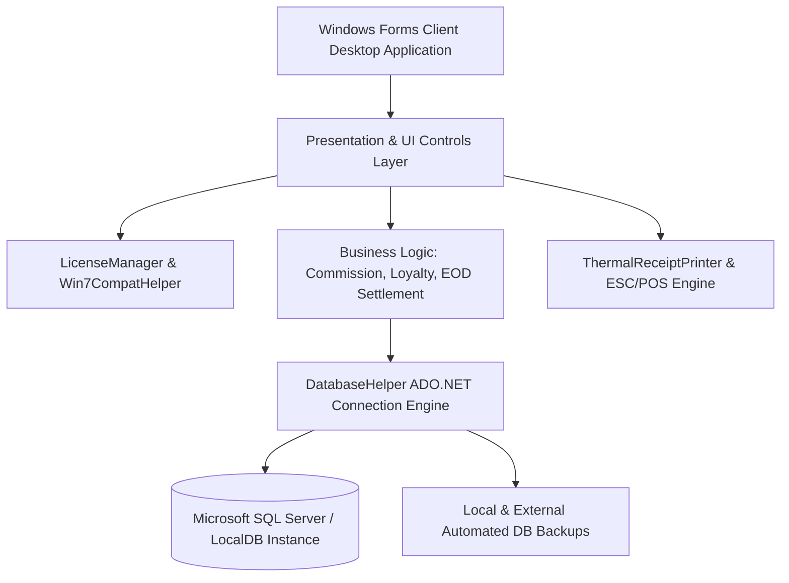
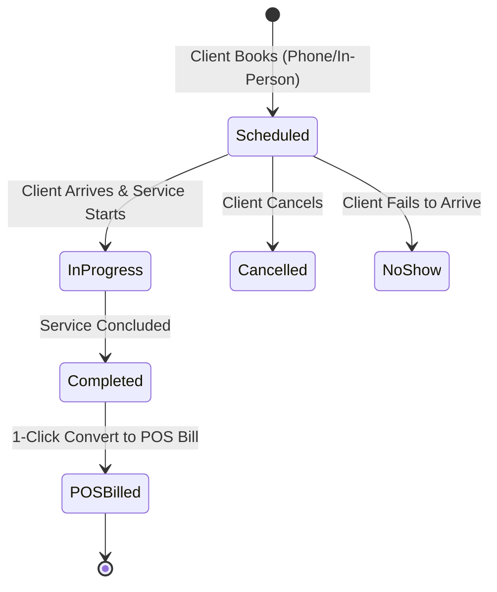
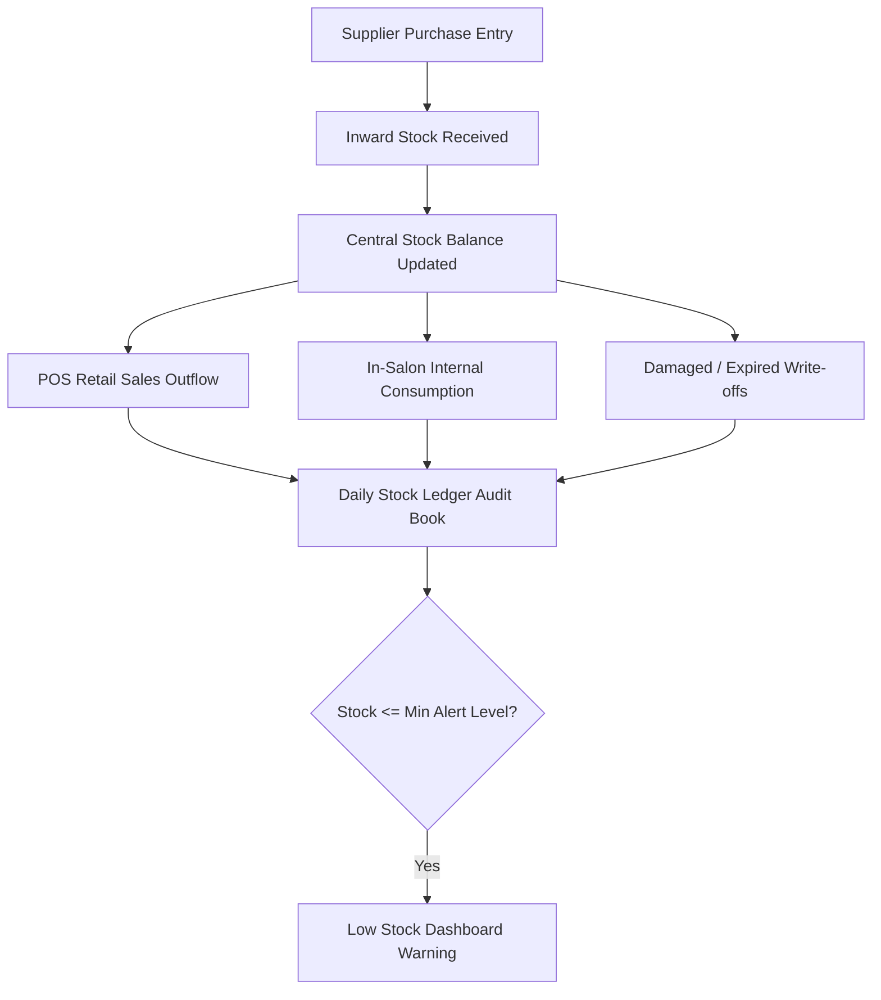
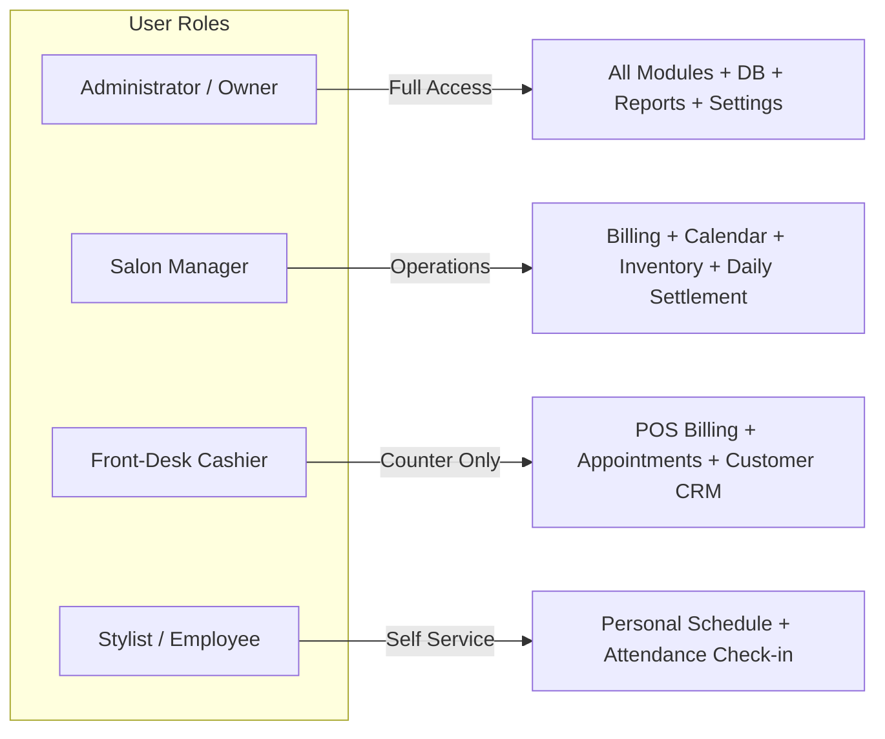

# MeroDokan Saloon & Spa Management System
## Complete Technical Project Documentation, Module Workflows, Project Completion Sign-Off & Annual Maintenance Contract (AMC)

---

**Document Reference:** `DOC-MERO-SALOON-2026-v2.6`  
**Date of Issuance:** September 1, 2026  
**Software Version:** Enterprise POS & CRM Suite v2.6  
**Target Environment:** Windows 10 / 11 (64-bit), Offline-First Desktop Client with MS SQL Server LocalDB  

---

## Table of Contents

1. [Executive Summary & Solution Overview](#1-executive-summary--solution-overview)
2. [Technical Architecture & System Specifications](#2-technical-architecture--system-specifications)
3. [Comprehensive Module-by-Module Operational Workflows](#3-comprehensive-module-by-module-operational-workflows)
   - [3.1 Express POS & Multi-Mode Smart Billing Workflow](#31-express-pos--multi-mode-smart-billing-workflow)
   - [3.2 Visual Appointment Scheduling & Booking Lifecycle](#32-visual-appointment-scheduling--booking-lifecycle)
   - [3.3 Staff Roster, Attendance & Automated Commission Engine](#33-staff-roster-attendance--automated-commission-engine)
   - [3.4 Customer CRM, Credit/Dues Ledger & Loyalty Engine](#34-customer-crm-creditdues-ledger--loyalty-engine)
   - [3.5 Inventory, Inward Purchase & Stock Ledger Book](#35-inventory-inward-purchase--stock-ledger-book)
   - [3.6 Master Catalog & Statutory Tax (HSN/SAC) Setup](#36-master-catalog--statutory-tax-hsnsac-setup)
   - [3.7 Day-End Cash Register Settlement (EOD Reconciliation)](#37-day-end-cash-register-settlement-eod-reconciliation)
   - [3.8 Business Intelligence, Analytics & Audit Reports](#38-business-intelligence-analytics--audit-reports)
   - [3.9 Security, Role-Based Access Control (RBAC) & Database Backups](#39-security-role-based-access-control-rbac--database-backups)
4. [Project Deliverables & User Acceptance Testing (UAT) Matrix](#4-project-deliverables--user-acceptance-testing-uat-matrix)
5. [Official Project Completion & Handover Sign-Off Certificate](#5-official-project-completion--handover-sign-off-certificate)
6. [Annual Maintenance Contract (AMC) Service Terms & SLA](#6-annual-maintenance-contract-amc-service-terms--sla)
7. [Standard Terms & Conditions and Legal Disclaimers](#7-standard-terms--conditions-and-legal-disclaimers)

---

## 1. Executive Summary & Solution Overview

The **MeroDokan Saloon & Spa Management System** is a mission-critical, enterprise desktop Point-of-Sale (POS), Customer Relationship Management (CRM), and resource planning suite engineered specifically for beauty salons, hair studios, unisex grooming lounges, cosmetic clinics, and luxury wellness spas.

### Core Value Propositions
- **100% Offline-First Stability:** Operates natively without requiring active internet connectivity, guaranteeing zero counter downtime during peak salon hours.
- **Dual-Item Hybrid Billing:** Seamlessly combines salon services (Haircut, Facial, Color, Spa) and retail take-home products (Shampoos, Serums, Conditioners) on a single invoice.
- **Automated Stylist Commission Engine:** Instantly calculates service commissions and retail sales incentives per staff member on each line item.
- **Visual Clash-Free Appointment Booking:** Prevents double-booking stylists through dynamic availability checks and 1-click bill conversion.
- **Multi-Format Receipt Engine:** Native ESC/POS thermal printing (58mm / 80mm) with custom branding alongside A4/A5 GST/VAT tax invoicing.
- **Complete Data Sovereignty & Hardware Locking:** Client database is securely stored locally with automated multi-layer encrypted backups and machine-locked license verification.

---

## 2. Technical Architecture & System Specifications

### 2.1 System Architecture



### 2.2 Hardware & System Requirements

| Component | Minimum Specification | Recommended Specification |
| :--- | :--- | :--- |
| **Operating System** | Windows 10 (64-bit) / Windows 7 SP1 with .NET 4.8 | Windows 11 / Windows 10 Pro (64-bit) |
| **Processor (CPU)** | Intel Core i3 (4th Gen) / AMD Ryzen 3 | Intel Core i5 (8th Gen+) / AMD Ryzen 5 |
| **Memory (RAM)** | 4 GB DDR3 / DDR4 | 8 GB – 16 GB DDR4/DDR5 |
| **Storage** | 500 MB free HDD space | High-speed NVMe / SATA SSD |
| **Display Resolution** | 1280 x 720 (HD) | 1920 x 1080 (Full HD) |
| **Thermal Printer** | 58mm (2-inch) ESC/POS USB Printer | 80mm (3-inch) High-Speed ESC/POS USB/LAN Printer |
| **Barcode Scanner** | 1D Handheld USB Scanner | 1D/2D Omnidirectional Hands-Free Laser Scanner |
| **Cash Drawer** | RJ11 / RJ12 interface connected to thermal printer | Heavy-duty steel cash drawer triggered automatically |

---

## 3. Comprehensive Module-by-Module Operational Workflows


---

### 3.1 Express POS & Multi-Mode Smart Billing Workflow

#### Purpose
To provide cashiers and front-desk receptionists with a fast, touch-friendly, error-proof billing screen capable of handling high customer footfall.

#### Step-by-Step Operational Workflow
1. **Customer Selection / Fast Creation:**
   - Cashier enters client mobile number or searches by name.
   - For walk-ins, defaults to `Walk-in Client`.
   - If new, user enters name and mobile; the system auto-registers the customer and displays their available loyalty points and historical dues.
2. **Item Addition (Dual Service & Product Selection):**
   - **Services:** Click category tabs (Hair, Facial, Spa, etc.) and select services, or search by name/shortcode.
   - **Retail Products:** Scan barcode via barcode reader or search from product catalog.
3. **Stylist / Staff Assignment:**
   - Each individual service line can be assigned to a distinct stylist (e.g., Stylist A for Haircut, Stylist B for Hair Color).
   - System automatically loads the default commission percentage or fixed amount configured for that stylist/service.
4. **Discounts & Custom Adjustments:**
   - Apply line-item level discount (% or Flat Rs.).
   - Apply overall bill discount with optional authorization safeguard.
5. **Bill Hold & Recall ("Park Bill"):**
   - If a client pauses to get an extra treatment or verify payment, cashier clicks **Hold Bill**.
   - Cashier services the next customer. When ready, cashier clicks **Recall Bill** to restore cart state without losing data.
6. **Payment Settlement Modes:**
   - Supports: **Cash**, **Credit/Debit Card**, **UPI / Dynamic QR Code**, **Customer Due (Credit)**, **Loyalty Points Redemption**, and **Split Multi-Tender** (e.g., Rs. 500 Cash + Rs. 1,000 UPI).
7. **Receipt Generation & Auto-Print:**
   - Click **Save & Print**.
   - Thermal printer outputs an 80mm / 58mm receipt formatted with salon logo, customer details, stylist breakdown, tax breakdown (CGST/SGST/VAT), loyalty points earned, and greeting footer.
   - Cash drawer kick-out signal is dispatched via ESC/POS command.

---

### 3.2 Visual Appointment Scheduling & Booking Lifecycle



#### Step-by-Step Operational Workflow
1. **Appointment Creation:**
   - Click **New Appointment** from Header or Appointment Board.
   - Select Customer, Booking Date, Time Slot, Required Services, and Assigned Stylist.
2. **Clash Detection & Time Lock:**
   - System queries active bookings in real-time. If the chosen stylist is already occupied in that time slot, a warning is raised to eliminate scheduling conflicts.
3. **Stylist Schedule Board (Timeline Matrix):**
   - Visual timeline displaying columns for each stylist with color-coded appointment cards:
     - 🟦 *Scheduled* | 🟨 *In-Progress* | 🟩 *Completed* | 🟥 *Cancelled / No Show*
4. **Seamless Conversion to Bill:**
   - When service is done, right-click the appointment or click **Bill Now**.
   - The system automatically transitions the appointment into the POS billing cart with the customer name, services, and assigned stylist pre-populated.

---

### 3.3 Staff Roster, Attendance & Automated Commission Engine

#### Step-by-Step Operational Workflow
1. **Staff Master & Role Configuration:**
   - Create staff profiles: Name, Mobile, Designation (Senior Stylist, Junior Stylist, Therapist, Beautician, Receptionist), Base Salary, and Default Commission Rates.
2. **Daily Attendance & Availability Tracking:**
   - Staff members check-in / check-out at start/end of shifts.
   - Staff can toggle their availability status (Available, On Break, Busy) to keep receptionists updated.
3. **Commission Computation Engine:**
   - Service Commission = $(\text{Service Price} - \text{Line Discount}) \times \text{Commission Rate} \%$.
   - Product Commission = $(\text{Product Retail Price} - \text{Discount}) \times \text{Retail Incentive Rate} \%$.
   - Tips and allowances recorded per bill.
4. **Payroll & Performance Reporting:**
   - Generate Monthly Staff Commission Summaries for 1-click payroll processing.

---

### 3.4 Customer CRM, Credit/Dues Ledger & Loyalty Engine

#### Step-by-Step Operational Workflow
1. **Customer Profile & Preferences:**
   - Captures Contact Info, Gender, Birthday, Anniversary, and special styling notes/allergies.
2. **Loyalty Rewards Engine:**
   - Configurable earn rate (e.g., 1 Loyalty Point for every Rs. 100 spent).
   - Configurable redemption value (e.g., 1 Point = Rs. 1 discount).
   - Real-time point accrual upon bill settlement; immediate deduction when redeemed.
3. **Customer Credit / Outstanding Dues Management:**
   - Unpaid or partial invoices recorded into the Customer Due Ledger.
   - Cashier can open Customer Ledger, review historical unpaid bills, and settle balances with dedicated receipt generation.
4. **Retention Alerts:**
   - Dashboard notifications for upcoming client birthdays, anniversaries, and inactive clients for re-engagement.

---

### 3.5 Inventory, Inward Purchase & Stock Ledger Book



#### Step-by-Step Operational Workflow
1. **Product Master:**
   - Name, Barcode/SKU, Brand, Category, Purchase Price, Selling Price, Tax (GST/VAT), Unit of Measure, Minimum Alert Quantity.
2. **Inward Purchase Orders:**
   - Record purchases with Supplier Invoice No, Batch No, Expiry Date, Supplier GSTIN, and Purchase Cost.
   - Automatically calculates landed cost and updates average inventory valuation.
3. **Stock Segregation (Retail vs. In-Salon Consumption):**
   - **Retail Products:** Deducted automatically upon POS invoice generation.
   - **Back-Bar Consumption:** Stylists record internal salon supplies used (e.g., Bleach, Developer, Wax, Massage Oils) to track operational salon expenses accurately.
4. **Daily Stock Ledger Book:**
   - Real-time mathematical audit trail:
     $$\text{Closing Stock} = \text{Opening Stock} + \text{Purchases} - \text{Sales} - \text{Internal Usage} - \text{Returns}$$

---

### 3.6 Master Catalog & Statutory Tax (HSN/SAC) Setup

#### Step-by-Step Operational Workflow
1. **Service Category & Menu Management:**
   - Hierarchy: Categories (Hair Care, Skin & Beauty, Spa, Bridal, Nail Studio) $\rightarrow$ Sub-services with customizable duration (minutes) and pricing tiers.
2. **HSN / SAC Tax Master:**
   - Standard SAC Code `999721` (Hairdressing and barbers services), `999722` (Cosmetic treatment, manicure, pedicure), etc.
   - Define GST Slabs: 0%, 5%, 12%, 18%, 28% with automated CGST + SGST or IGST tax breakdown on thermal receipts and tax invoices.
3. **Supplier & Vendor Management:**
   - Maintain supplier contact directories, GSTIN/PAN, and payment terms.

---

### 3.7 Day-End Cash Register Settlement (EOD Reconciliation)

#### Purpose
Guarantees financial integrity at shift handover and end of business day, preventing cash leakage and tallying digital collections.

#### Step-by-Step Operational Workflow
1. **Opening Float:** Cashier enters opening drawer cash float at morning startup.
2. **Daily Transactions Aggregation:**
   - Total Cash Inflow (Cash Sales + Customer Due Settlements).
   - Total Digital Collections (UPI, Card, Wallets).
   - Cash Outflows (Petty Cash expenses, Vendor payouts).
3. **Reconciliation Formula:**
   $$\text{Expected System Cash} = \text{Opening Float} + \text{Cash Sales} + \text{Due Collections} - \text{Petty Expenses}$$
4. **Physical Cash Counting & Discrepancy Audit:**
   - Cashier enters actual physical currency denomination count.
   - System calculates:
     $$\text{Variance / Discrepancy} = \text{Actual Cash} - \text{Expected Cash}$$
   - Highlighted in green (Exact/Surplus) or red (Shortage).
5. **EOD Printout & Shift Closing:**
   - Generate summary thermal slip with Manager signature block for cash handover.

---

### 3.8 Business Intelligence, Analytics & Audit Reports

The reporting module provides 20+ exportable reports with granular filters (Date Range, Staff, Service Category, Customer, Payment Mode):

| Report Category | Key Reports Available | Export Formats |
| :--- | :--- | :--- |
| **Sales Analytics** | Daily Sales Summary, Invoice-wise Register, Item-wise Sales, Category-wise Sales, Payment Tender Summary | Excel (.xlsx), CSV, PDF, Print |
| **Staff & Stylist** | Stylist Commission Summary, Staff Productivity Matrix, Service Count by Stylist, Tip Report | Excel (.xlsx), CSV, PDF, Print |
| **Appointments** | Booking Conversion Rate, No-Show/Cancellation Audit, Peak Time Slot Heatmap | Excel (.xlsx), CSV, PDF, Print |
| **Inventory & Stock** | Daily Stock Ledger, Low Stock Warning Report, Stock Valuation (FIFO/Avg Cost), Consumption Audit | Excel (.xlsx), CSV, PDF, Print |
| **Customer CRM** | Top Spending Clients, Customer Dues Aging, Loyalty Points Ledger, Inactive Client List | Excel (.xlsx), CSV, PDF, Print |
| **Tax & Compliance** | GSTR-1 / VAT B2C Summary, HSN/SAC Tax Breakdown, Tax Invoices Audit | Excel (.xlsx), CSV, PDF, Print |

---

### 3.9 Security, Role-Based Access Control (RBAC) & Database Backups



#### Security & Backup Specifications:
- **Encrypted Password Storage:** Multi-pass cryptographic hashing.
- **Hardware-Bound Machine Licensing:** Prevents unauthorized copying or deployment.
- **Automated DB Backup:** Auto-triggers daily backup on application close to a configured local folder or external drive.
- **1-Click Database Restore & Maintenance:** Integrated backup verification with SQL Server index optimization.

---

## 4. Project Deliverables & User Acceptance Testing (UAT) Matrix

| Module / Scope | Test Case Description | Verification Standard | UAT Status |
| :---: | :--- | :--- | :---: |
| **POS-01** | Dual Service + Product line item billing | Correct price, tax, discount, and total calculated | ✅ PASSED |
| **POS-02** | Multi-Tender Split Payment (Cash + UPI + Card) | Individual payment totals match invoice grand total | ✅ PASSED |
| **POS-03** | ESC/POS 80mm & 58mm Thermal Printer integration | High-speed receipt print, alignment, logo, & drawer kick | ✅ PASSED |
| **APT-01** | Visual calendar slot booking with clash detection | Prevents double-booking same stylist in overlapping slot | ✅ PASSED |
| **APT-02** | 1-Click appointment to POS bill conversion | Loads customer, services, and stylist seamlessly | ✅ PASSED |
| **STF-01** | Automated Stylist Commission computation | Calculates correct % and flat commission per line item | ✅ PASSED |
| **STF-02** | Stylist schedule board & daily attendance check-in | Attendance timestamp logged, status updated live | ✅ PASSED |
| **INV-01** | Product inward purchase & automatic stock increment | Cost, tax, batch logged, stock balance updated | ✅ PASSED |
| **INV-02** | Real-time POS deduction & Daily Stock Ledger audit | Sales deducted accurately; ledger matches physical count | ✅ PASSED |
| **CRM-01** | Loyalty points earning & checkout redemption | Points balance accrues and redeems as expected | ✅ PASSED |
| **CRM-02** | Customer dues recording & subsequent settlement | Customer balance updated; settlement receipt generated | ✅ PASSED |
| **EOD-01** | Day-End Cash Register Settlement & Discrepancy | Reconciles opening float + sales - expenses accurately | ✅ PASSED |
| **REP-01** | Generation of 20+ analytical reports & Excel export | Reports compute accurate numbers; clean file export | ✅ PASSED |
| **SEC-01** | Role-Based Access Control (Admin, Manager, Cashier) | Restricted areas blocked for unauthorized staff | ✅ PASSED |
| **BCK-01** | Automated & Manual Database Backup and Restore | Backup `.bak` created and restored successfully | ✅ PASSED |

---

## 5. Official Project Completion & Handover Sign-Off Certificate

### 5.1 Project Handover Confirmation
This document certifies that the **MeroDokan Saloon & Spa Management System (v2.6)** has been successfully developed, customized, installed, tested, and commissioned for the Client's business premises. 

By signing below, both parties confirm that:
1. All software modules detailed in Section 3 and Section 4 have been delivered and verified in full working order.
2. Hardware integration (Workstation, Thermal Receipt Printer, Barcode Scanner, Cash Drawer) has been calibrated and tested successfully.
3. Salon management, cashiers, and front-desk staff have received comprehensive user training.
4. The 12-Month Complimentary Standard Technical Warranty is officially activated starting from the handover date.

---

### 5.2 Acceptance Sign-Off Authorization

```
+----------------------------------------------------------------------------------------------------+
|                                    PROJECT SIGN-OFF & ACCEPTANCE                                    |
+---------------------------------------------------+------------------------------------------------+
| FOR SERVICE PROVIDER:                             | FOR CLIENT / SALON MANAGEMENT:                 |
|                                                   |                                                |
| Organization: MeroDokan Software Solutions       | Business Name: _______________________________ |
| Authorized Lead: ________________________________ | Authorized Person: ___________________________ |
| Designation: Lead Solutions Architect             | Designation: Owner / Managing Director         |
| Date: September 1, 2026                           | Date: ________________________________________ |
|                                                   |                                                |
| Signature & Seal:                                 | Signature & Seal:                              |
|                                                   |                                                |
| _________________________________________________ | ______________________________________________ |
+---------------------------------------------------+------------------------------------------------+
```

---

## 6. Annual Maintenance Contract (AMC) Service Terms & SLA

### 6.1 AMC Commercial Schedule & Pricing

| Service Description | Year 1 (Warranty Period) | Year 2 Onwards (Annual AMC) | Billing Frequency |
| :--- | :---: | :---: | :---: |
| **MeroDokan Saloon POS Primary Node AMC** | **Rs. 0.00 (100% FREE)** | **Rs. 4,500 /- per year** | Annual Advance |
| **Additional Terminal / LAN Node Support** | **Rs. 0.00 (100% FREE)** | **Rs. 1,500 /- per node/yr** | Annual Advance |
| **On-Demand Custom Feature Development** | As per scope | Discounted AMC Hourly Rate | Per Milestone |

---

### 6.2 Scope of AMC Services (Inclusions)
The Annual Maintenance Contract guarantees continuous, smooth operation of your salon management system:
1. **Dedicated Remote Technical Support:** Unlimited remote desktop troubleshooting (via AnyDesk / TeamViewer / UltraViewer) for software operational issues, driver reconfigurations, and billing inquiries.
2. **Software Patches & Minor Upgrades:** Free deployment of minor software updates, speed enhancements, and statutory tax modifications.
3. **Database Health Checks & Optimization:** Periodic reindexing, fragmentation cleanup, and database performance tuning.
4. **Disaster Recovery & Data Restoration:** Priority assistance in restoring database backups in case of computer hardware crashes, OS reinstallation, or virus attacks.
5. **Printer & Hardware Re-Calibration:** Reconfiguring thermal receipt printers and barcode scanners following Windows updates or peripheral replacements.
6. **Staff Retraining Support:** Periodic refresher guidance for newly hired cashiers or salon managers.

---

### 6.3 Exclusions from AMC Coverage
The following items are outside the standard AMC scope and will be billed separately:
1. Physical repair or replacement of hardware components (Thermal printers, PC motherboards, hard drives, barcode scanners).
2. Fixing issues resulting from unauthorized third-party tampering with the database or operating system malware infections.
3. Major bespoke software redesigns or feature additions requiring new architecture.
4. On-site physical visits outside city limits (unless travel and logistics expenses are covered by the client).

---

### 6.4 Service Level Agreement (SLA) & Incident Response Matrix

```mermaid
graph TD
    Ticket[Incident Reported via Phone / WhatsApp / Remote] --> Level{Severity Level}
    Level -->|Critical P1: Counter Down| P1[Response: < 30 Mins | Resolution: < 2 Hours]
    Level -->|High P2: Feature Degraded| P2[Response: < 2 Hours | Resolution: < 6 Hours]
    Level -->|Standard P3: General Inquiry| P3[Response: < 4 Hours | Resolution: < 24 Hours]
```

| Severity Level | Description | Response Time | Target Resolution | Support Channel |
| :--- | :--- | :---: | :---: | :--- |
| **P1 - Critical Emergency** | POS Counter halted, billing down, database inaccessible | **< 30 Minutes** | **< 2 Hours** | Direct Emergency Phone Call + Immediate Remote AnyDesk |
| **P2 - High Priority** | A major module (e.g. Appointment sync or Thermal Printer) not working | **< 2 Hours** | **< 6 Hours** | Priority Phone / WhatsApp + Remote Session |
| **P3 - Standard Request** | General usability question, minor report filter issue, new staff query | **< 4 Hours** | **< 24 Hours** | WhatsApp Support / Helpdesk Portal |

---

## 7. Standard Terms & Conditions and Legal Disclaimers

1. **Perpetual Software License:** The software license granted to the Client is perpetual for the designated workstations. The client owns their local database and all associated business data entirely.
2. **Data Privacy & Confidentiality:** All customer lists, billing numbers, staff salaries, and financial records remain strictly confidential and stored on the Client's local machine. The Service Provider will not share or copy client data without explicit authorization.
3. **Client Obligations:** The Client is responsible for ensuring regular power backup (UPS) for counter computers and ensuring that automated daily database backups are not manually deleted or corrupted.
4. **AMC Payment Terms:** AMC charges are payable annually in advance within 15 days of the renewal date. Failure to renew the AMC will transition technical support to a chargeable per-incident ticket basis without affecting the perpetual offline usage of the POS software.
5. **Governing Law & Jurisdiction:** This agreement and any disputes arising under it shall be governed by and construed in accordance with the applicable laws of the local commercial jurisdiction.

---

*Document Generated and Maintained by MeroDokan Engineering & Solutions Team.*
